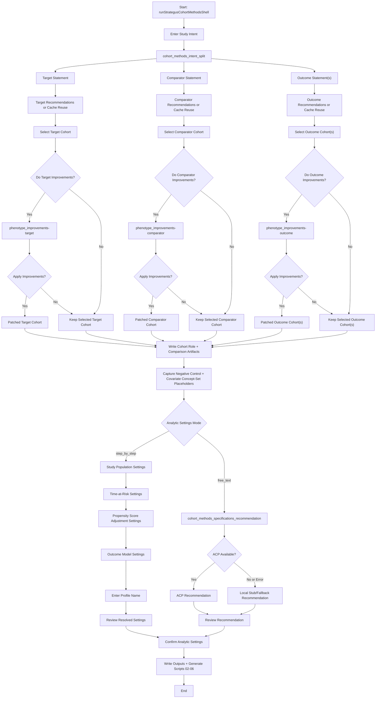
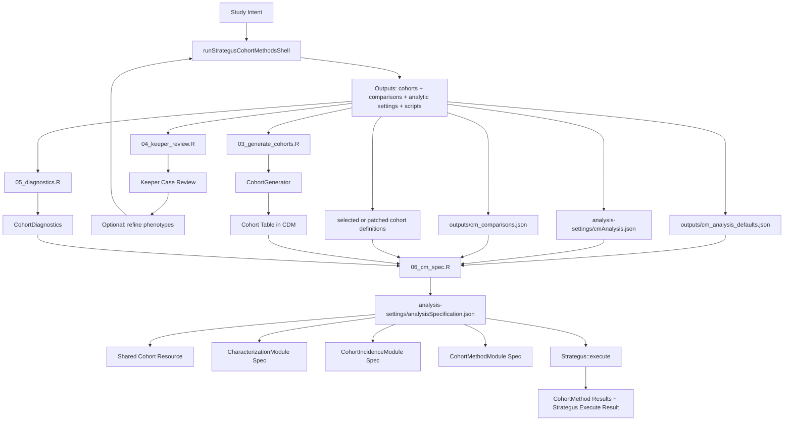

**Cohort Methods Workflow**

This document captures the current cohort-methods workflow implemented by `OHDSIAssistant::runStrategusCohortMethodsShell()` and how it fits into a broader Strategus execution pipeline.

## Shell Workflow (Target/Comparator/Outcome + Analytic Settings)

## Strategus Execution Context

