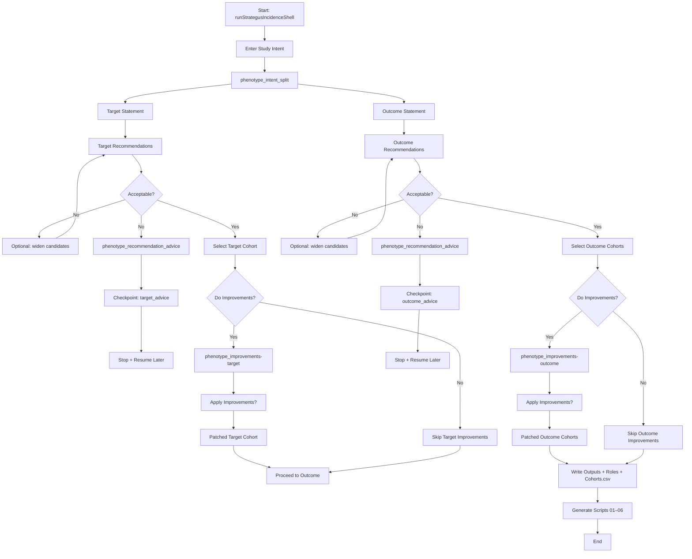
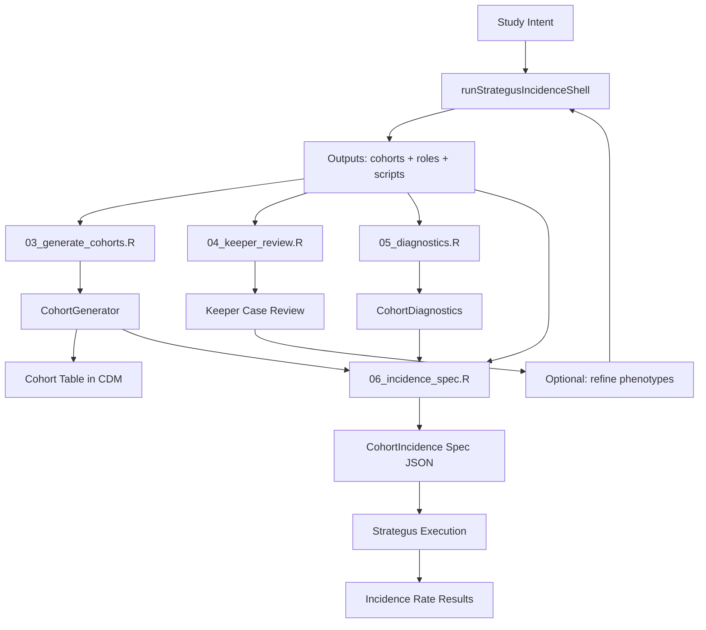

**Incidence Workflow**

This document captures the current incidence-rate workflow implemented by
`OHDSIAssistant::runStrategusIncidenceShell()` and how it fits into a broader
Strategus execution pipeline.

## Shell Workflow (Target/Outcome Orchestration)

## Strategus Execution Context

