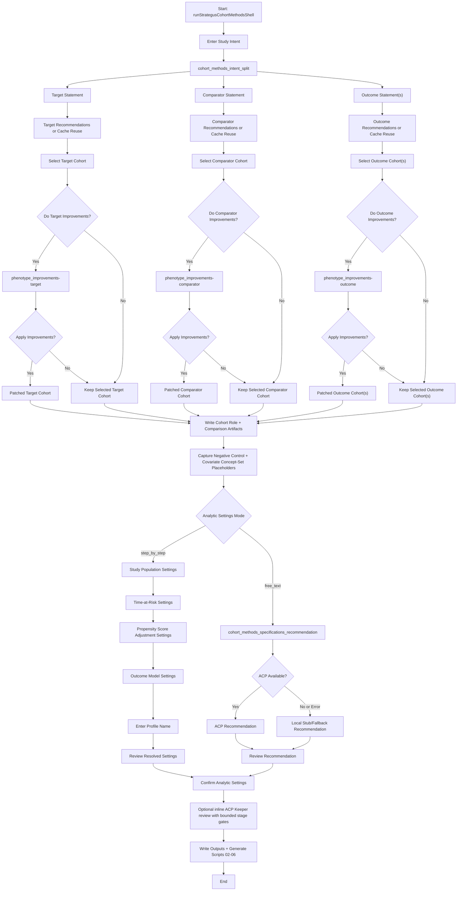
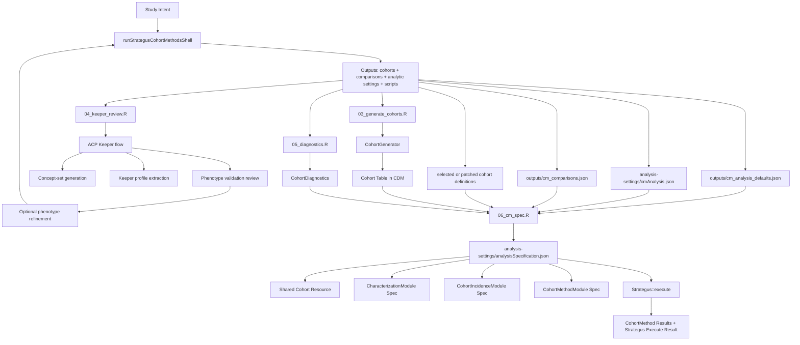

**Cohort Methods Workflow**

This document captures the current cohort-methods workflow implemented by `slashOhdsiStrategusAssistant::runStrategusCohortMethodsShell()` and how it fits into a broader Strategus execution pipeline.

## Shell Workflow (Target/Comparator/Outcome + Analytic Settings)

## Strategus Execution Context

## Current Explicit Limitations

- Negative-control and covariate concept-set workflows are still placeholder-based.
- ACP analytic-settings recommendations are converted into shell settings, but a dedicated recommendation validation layer is still pending.
